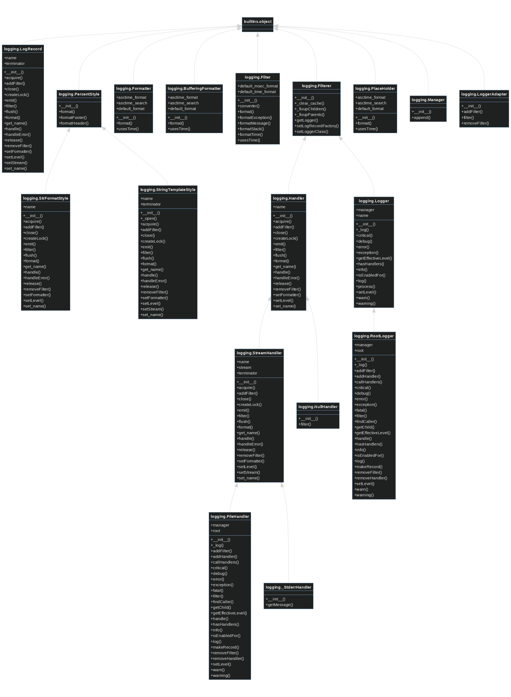

# py2uml

WIP!!!

## Installation

I recommend using [`pipx`](https://pypa.github.io/pipx/) for installing
cli-tools like this one.

```bash
pipx install git+https://github.com/mmngreco/py2uml
```

## Usage

```bash
py2uml --help
py2uml --pkg logging
```

- Note 1: The package must be installed.
- Note 2: Only classes will be processed.


## Example

<details>

<summary><code>py2uml --pkg logging</code></summary>

```bash
classDiagram

linkStyle default interpolate basis

`logging._StderrHandler`
`logging.BufferingFormatter`
`logging.PlaceHolder`
`logging.Formatter`
`logging.Filter`
`logging.PercentStyle`
`logging.NullHandler`
`logging.LoggerAdapter`
`logging.StrFormatStyle`
`logging.LogRecord`
`logging.StringTemplateStyle`
`logging.StreamHandler`
`logging.Manager`
`logging.Filterer`
`logging.RootLogger`
`logging.FileHandler`
`logging.Logger`
`logging.Handler`
`builtins.object` <|-- `logging.LogRecord`
`builtins.object` <|-- `logging.PercentStyle`
`logging.PercentStyle` <|-- `logging.StrFormatStyle`
`logging.PercentStyle` <|-- `logging.StringTemplateStyle`
`builtins.object` <|-- `logging.Formatter`
`builtins.object` <|-- `logging.BufferingFormatter`
`builtins.object` <|-- `logging.Filter`
`builtins.object` <|-- `logging.Filterer`
`logging.Filterer` <|-- `logging.Handler`
`logging.Handler` <|-- `logging.StreamHandler`
`logging.StreamHandler` <|-- `logging.FileHandler`
`logging.StreamHandler` <|-- `logging._StderrHandler`
`builtins.object` <|-- `logging.PlaceHolder`
`builtins.object` <|-- `logging.Manager`
`logging.Filterer` <|-- `logging.Logger`
`logging.Logger` <|-- `logging.RootLogger`
`builtins.object` <|-- `logging.LoggerAdapter`
`logging.Handler` <|-- `logging.NullHandler`
`logging._StderrHandler`: +__init__()
`logging._StderrHandler`: +getMessage()
`logging.BufferingFormatter`: +__init__()
`logging.BufferingFormatter`: +asctime_format
`logging.BufferingFormatter`: +asctime_search
`logging.BufferingFormatter`: +default_format
`logging.BufferingFormatter`: +format()
`logging.BufferingFormatter`: +usesTime()
`logging.PlaceHolder`: +__init__()
`logging.PlaceHolder`: +asctime_format
`logging.PlaceHolder`: +asctime_search
`logging.PlaceHolder`: +default_format
`logging.PlaceHolder`: +format()
`logging.PlaceHolder`: +usesTime()
`logging.Formatter`: +__init__()
`logging.Formatter`: +asctime_format
`logging.Formatter`: +asctime_search
`logging.Formatter`: +default_format
`logging.Formatter`: +format()
`logging.Formatter`: +usesTime()
`logging.Filter`: +__init__()
`logging.Filter`: +converter()
`logging.Filter`: +default_msec_format
`logging.Filter`: +default_time_format
`logging.Filter`: +format()
`logging.Filter`: +formatException()
`logging.Filter`: +formatMessage()
`logging.Filter`: +formatStack()
`logging.Filter`: +formatTime()
`logging.Filter`: +usesTime()
`logging.PercentStyle`: +__init__()
`logging.PercentStyle`: +format()
`logging.PercentStyle`: +formatFooter()
`logging.PercentStyle`: +formatHeader()
`logging.NullHandler`: +__init__()
`logging.NullHandler`: +filter()
`logging.LoggerAdapter`: +__init__()
`logging.LoggerAdapter`: +addFilter()
`logging.LoggerAdapter`: +filter()
`logging.LoggerAdapter`: +removeFilter()
`logging.StrFormatStyle`: +__init__()
`logging.StrFormatStyle`: +acquire()
`logging.StrFormatStyle`: +addFilter()
`logging.StrFormatStyle`: +close()
`logging.StrFormatStyle`: +createLock()
`logging.StrFormatStyle`: +emit()
`logging.StrFormatStyle`: +filter()
`logging.StrFormatStyle`: +flush()
`logging.StrFormatStyle`: +format()
`logging.StrFormatStyle`: +get_name()
`logging.StrFormatStyle`: +handle()
`logging.StrFormatStyle`: +handleError()
`logging.StrFormatStyle`: +name
`logging.StrFormatStyle`: +release()
`logging.StrFormatStyle`: +removeFilter()
`logging.StrFormatStyle`: +setFormatter()
`logging.StrFormatStyle`: +setLevel()
`logging.StrFormatStyle`: +set_name()
`logging.LogRecord`: +__init__()
`logging.LogRecord`: +acquire()
`logging.LogRecord`: +addFilter()
`logging.LogRecord`: +close()
`logging.LogRecord`: +createLock()
`logging.LogRecord`: +emit()
`logging.LogRecord`: +filter()
`logging.LogRecord`: +flush()
`logging.LogRecord`: +format()
`logging.LogRecord`: +get_name()
`logging.LogRecord`: +handle()
`logging.LogRecord`: +handleError()
`logging.LogRecord`: +name
`logging.LogRecord`: +release()
`logging.LogRecord`: +removeFilter()
`logging.LogRecord`: +setFormatter()
`logging.LogRecord`: +setLevel()
`logging.LogRecord`: +setStream()
`logging.LogRecord`: +set_name()
`logging.LogRecord`: +terminator
`logging.StringTemplateStyle`: +__init__()
`logging.StringTemplateStyle`: +_open()
`logging.StringTemplateStyle`: +acquire()
`logging.StringTemplateStyle`: +addFilter()
`logging.StringTemplateStyle`: +close()
`logging.StringTemplateStyle`: +createLock()
`logging.StringTemplateStyle`: +emit()
`logging.StringTemplateStyle`: +filter()
`logging.StringTemplateStyle`: +flush()
`logging.StringTemplateStyle`: +format()
`logging.StringTemplateStyle`: +get_name()
`logging.StringTemplateStyle`: +handle()
`logging.StringTemplateStyle`: +handleError()
`logging.StringTemplateStyle`: +name
`logging.StringTemplateStyle`: +release()
`logging.StringTemplateStyle`: +removeFilter()
`logging.StringTemplateStyle`: +setFormatter()
`logging.StringTemplateStyle`: +setLevel()
`logging.StringTemplateStyle`: +setStream()
`logging.StringTemplateStyle`: +set_name()
`logging.StringTemplateStyle`: +terminator
`logging.StreamHandler`: +__init__()
`logging.StreamHandler`: +acquire()
`logging.StreamHandler`: +addFilter()
`logging.StreamHandler`: +close()
`logging.StreamHandler`: +createLock()
`logging.StreamHandler`: +emit()
`logging.StreamHandler`: +filter()
`logging.StreamHandler`: +flush()
`logging.StreamHandler`: +format()
`logging.StreamHandler`: +get_name()
`logging.StreamHandler`: +handle()
`logging.StreamHandler`: +handleError()
`logging.StreamHandler`: +name
`logging.StreamHandler`: +release()
`logging.StreamHandler`: +removeFilter()
`logging.StreamHandler`: +setFormatter()
`logging.StreamHandler`: +setLevel()
`logging.StreamHandler`: +setStream()
`logging.StreamHandler`: +set_name()
`logging.StreamHandler`: +stream
`logging.StreamHandler`: +terminator
`logging.Manager`: +__init__()
`logging.Manager`: +append()
`logging.Filterer`: +__init__()
`logging.Filterer`: +_clear_cache()
`logging.Filterer`: +_fixupChildren()
`logging.Filterer`: +_fixupParents()
`logging.Filterer`: +getLogger()
`logging.Filterer`: +setLogRecordFactory()
`logging.Filterer`: +setLoggerClass()
`logging.RootLogger`: +__init__()
`logging.RootLogger`: +_log()
`logging.RootLogger`: +addFilter()
`logging.RootLogger`: +addHandler()
`logging.RootLogger`: +callHandlers()
`logging.RootLogger`: +critical()
`logging.RootLogger`: +debug()
`logging.RootLogger`: +error()
`logging.RootLogger`: +exception()
`logging.RootLogger`: +fatal()
`logging.RootLogger`: +filter()
`logging.RootLogger`: +findCaller()
`logging.RootLogger`: +getChild()
`logging.RootLogger`: +getEffectiveLevel()
`logging.RootLogger`: +handle()
`logging.RootLogger`: +hasHandlers()
`logging.RootLogger`: +info()
`logging.RootLogger`: +isEnabledFor()
`logging.RootLogger`: +log()
`logging.RootLogger`: +makeRecord()
`logging.RootLogger`: +manager
`logging.RootLogger`: +removeFilter()
`logging.RootLogger`: +removeHandler()
`logging.RootLogger`: +root
`logging.RootLogger`: +setLevel()
`logging.RootLogger`: +warn()
`logging.RootLogger`: +warning()
`logging.FileHandler`: +__init__()
`logging.FileHandler`: +_log()
`logging.FileHandler`: +addFilter()
`logging.FileHandler`: +addHandler()
`logging.FileHandler`: +callHandlers()
`logging.FileHandler`: +critical()
`logging.FileHandler`: +debug()
`logging.FileHandler`: +error()
`logging.FileHandler`: +exception()
`logging.FileHandler`: +fatal()
`logging.FileHandler`: +filter()
`logging.FileHandler`: +findCaller()
`logging.FileHandler`: +getChild()
`logging.FileHandler`: +getEffectiveLevel()
`logging.FileHandler`: +handle()
`logging.FileHandler`: +hasHandlers()
`logging.FileHandler`: +info()
`logging.FileHandler`: +isEnabledFor()
`logging.FileHandler`: +log()
`logging.FileHandler`: +makeRecord()
`logging.FileHandler`: +manager
`logging.FileHandler`: +removeFilter()
`logging.FileHandler`: +removeHandler()
`logging.FileHandler`: +root
`logging.FileHandler`: +setLevel()
`logging.FileHandler`: +warn()
`logging.FileHandler`: +warning()
`logging.Logger`: +__init__()
`logging.Logger`: +_log()
`logging.Logger`: +critical()
`logging.Logger`: +debug()
`logging.Logger`: +error()
`logging.Logger`: +exception()
`logging.Logger`: +getEffectiveLevel()
`logging.Logger`: +hasHandlers()
`logging.Logger`: +info()
`logging.Logger`: +isEnabledFor()
`logging.Logger`: +log()
`logging.Logger`: +manager
`logging.Logger`: +name
`logging.Logger`: +process()
`logging.Logger`: +setLevel()
`logging.Logger`: +warn()
`logging.Logger`: +warning()
`logging.Handler`: +__init__()
`logging.Handler`: +acquire()
`logging.Handler`: +addFilter()
`logging.Handler`: +close()
`logging.Handler`: +createLock()
`logging.Handler`: +emit()
`logging.Handler`: +filter()
`logging.Handler`: +flush()
`logging.Handler`: +format()
`logging.Handler`: +get_name()
`logging.Handler`: +handle()
`logging.Handler`: +handleError()
`logging.Handler`: +name
`logging.Handler`: +release()
`logging.Handler`: +removeFilter()
`logging.Handler`: +setFormatter()
`logging.Handler`: +setLevel()
`logging.Handler`: +set_name()
```

</details>


Then, we can paste it in the [mermaid online
editor](https://mermaid-js.github.io/mermaid-live-editor/) or another render to
see the following:


